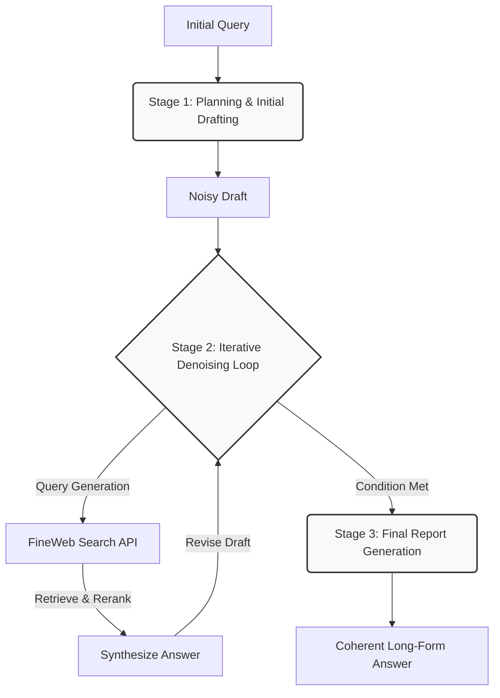

# TTD-RAG: Test-Time Diffusion Framework


> Conceptualizing complex multi-hop reasoning and report generation as an iterative "denoising" process. 

TTD-RAG is a robust research agent framework developed for the MMU-RAG Competition. Inspired by the *Deep Researcher with Test-Time Diffusion (TTD-DR)* paradigm, our agent progressively refines preliminary drafts through targeted search, intelligent synthesis, and systematic revision, yielding coherent, highly accurate long-form answers.

---

## 📑 Table of Contents
- [Problem Statement & Solution](#problem-statement--solution)
- [Quick Start](#quick-start)
- [Installation & Setup](#installation--setup)
- [Configuration](#configuration)
- [Usage Guide](#usage-guide)
- [Technical Architecture](#technical-architecture)
- [Performance & Benchmarking](#performance--benchmarking)
- [Contributing & Community](#contributing--community)
- [License](#license)

---

## 🎯 Problem Statement & Solution

**The Problem**: Traditional RAG architectures often struggle with complex, multi-hop reasoning tasks because initial retrieval steps may lack the necessary context, leading to information loss and disjointed reasoning.

**The Solution**: TTD-RAG employs **Report-Level Denoising with Retrieval** and **Component-wise Self-Evolution**:
1. **Denoising**: Instead of answering immediately, the agent generates a preliminary "noisy" draft and systematically resolves information gaps by querying the FineWeb Search API.
2. **Self-Evolution**: Planning and synthesis stages dynamically generate multiple output variants, score them, and merge the best aspects into superior outputs.

---

## ⚡ Quick Start

Experience the agent locally by starting the server and making a query:

```bash
# 1. Start the API server and vLLM
bash start.sh

# 2. Query the agent dynamically
curl -X POST http://localhost:5053/run \
     -H "Content-Type: application/json" \
     -d '{"question": "How does test-time diffusion improve multi-hop reasoning?"}'
```

---

## 🛠️ Installation & Setup

### Prerequisites
* Conda or Miniconda
* An NVIDIA GPU with 24GB+ VRAM (required for local vLLM serving)

### 1. Environment Configuration

Create the local environment file to safely store your API keys:

```bash
cp .env.example .env
```

> [!CAUTION]
> Ensure you populate `.env` with your `FINEWEB_API_KEY` and `OPENROUTER_API_KEY`. Never commit this file to version control.

### 2. Install Dependencies

We've recently streamlined our dependencies to include robust configuration and testing libraries. Create the environment and install dependencies:

```bash
conda env create -f environment.yml
conda activate ttdr

# Install core and recent dependencies
pip install pytest hydra-core pydantic omegaconf -e .
```

---

## ⚙️ Configuration

Our recent refactoring introduces a powerful, typed configuration system:

* **Hydra & OmegaConf**: Configurations for the LLM provider, search limits, and pipeline evolution steps are now managed via `configs/config.yaml`. This enables clean overrides and composable structures.
* **Pydantic Models**: Foundational classes in `src/config.py` enforce strict type-checking on all incoming configurations, catching errors before runtime.
* **Separated Utils**: Code clarity is improved with discrete utility modules located in `src/utils` (e.g., `logger.py`, `chunker.py`).

---

## 🚀 Usage Guide

### API Endpoints

Once `start.sh` is running (on port `5053`), the following endpoints are available:

* `GET /health` : Confirm the service is active.
* `POST /run` : Dynamic endpoint providing a Server-Sent Events (SSE) stream detailing intermediate steps and final reports.
* `POST /evaluate` : Static endpoint for standard JSON responses.

### Local Evaluation Scripts

You can validate the implementation locally against test suites using our utility scripts:

```bash
# Full test of both dynamic and static endpoints
python local_test.py --base-url http://localhost:5053

# Run specific GAIA or HLE evaluations (leveraging Hydra)
python eval/eval_gaia.py
```

---

## 🏗️ Technical Architecture



---

## 📊 Performance & Benchmarking

The agent is designed to meet strict competition latency limits while maintaining high fidelity. 
* Serving uses **vLLM** (`Qwen3-4B-Instruct-2507`) for high-throughput text generation.
* The local reranker (`Qwen3-Reranker-0.6B-seq-cls`) rapidly prioritizes contexts.
You can monitor standard benchmarks utilizing our integrated `eval` directory tools to measure accuracy, hallucination rates, and latency.

---

## 🤝 Contributing & Community

Contributions are welcome! Please ensure all code passes tests and adheres to the `Pydantic` models before submitting a Pull Request.
1. Fork the repository
2. Create your feature branch (`git checkout -b feature/AmazingFeature`)
3. Commit your changes (`git commit -m 'Add some AmazingFeature'`)
4. Push to the branch (`git push origin feature/AmazingFeature`)
5. Open a Pull Request

---

## 📄 License

Distributed under the MIT License. See `LICENSE` for more information.
